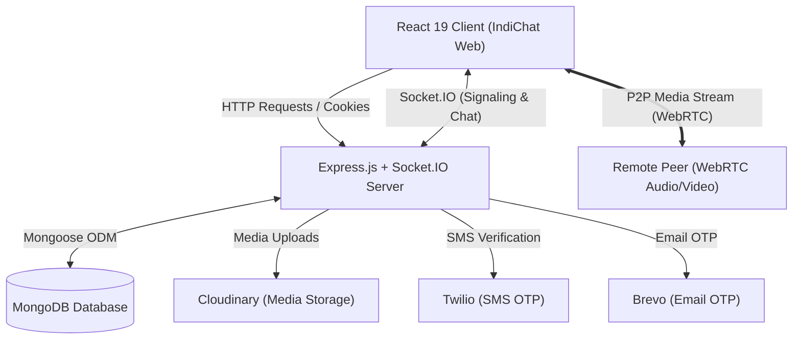

<div align="center">

# 💬 IndiChat
### *Modern Real-Time Messaging & WebRTC Video Calling Platform*

[](https://github.com/shwetang01/indichat-app/stargazers)
[](https://github.com/shwetang01/indichat-app/network/members)
[](https://github.com/shwetang01/indichat-app/issues)
[](LICENSE)

<br />

[](https://react.dev/)
[](https://nodejs.org/)
[](https://expressjs.com/)
[](https://www.mongodb.com/)
[](https://socket.io/)
[](https://webrtc.org/)
[](https://tailwindcss.com/)

<p align="center">
  <a href="#-key-features"><b>Features</b></a> •
  <a href="#️-tech-stack"><b>Tech Stack</b></a> •
  <a href="#-system-architecture"><b>Architecture</b></a> •
  <a href="#-quick-start-guide"><b>Getting Started</b></a> •
  <a href="#️-environment-variables-reference"><b>Environment Config</b></a> •
  <a href="#-api--socketio-reference"><b>API Docs</b></a>
</p>

</div>

---

**IndiChat** is a modern, full-stack MERN real-time communication platform engineered for instant messaging, peer-to-peer audio/video calling, and WhatsApp-style 24-hour status updates. It features passwordless OTP authentication (via SMS & Email), real-time presence, emoji reactions, media sharing via Cloudinary, and customizable themes.

---

## 📑 Table of Contents

- [✨ Key Features](#-key-features)
- [🛠️ Tech Stack](#️-tech-stack)
- [🏗️ System Architecture](#️-system-architecture)
- [📁 Project Structure](#-project-structure)
- [🚀 Quick Start Guide](#-quick-start-guide)
  - [Prerequisites](#prerequisites)
  - [1. Clone Repository](#1-clone-repository)
  - [2. Backend Setup](#2-backend-setup)
  - [3. Frontend Setup](#3-frontend-setup)
- [⚙️ Environment Variables Reference](#️-environment-variables-reference)
  - [Backend (`backend/.env`)](#backend-backendenv)
  - [Frontend (`frontend/.env`)](#frontend-frontendenv)
- [📡 API & Socket.IO Reference](#-api--socketio-reference)
  - [REST API Endpoints](#rest-api-endpoints)
  - [Socket.IO & WebRTC Events](#socketio--webrtc-events)
- [🗺️ Roadmap](#️-roadmap)
- [🤝 Contributing](#-contributing)
- [📄 License](#-license)

---

## ✨ Key Features

### 💬 Real-Time Messaging & Chat
- **Instant Messaging**: Low-latency direct messaging powered by **Socket.IO**.
- **Media Attachments**: Send images and video files uploaded securely to **Cloudinary**.
- **Message Reactions**: React to any message with emojis in real time.
- **Read Receipts & Delivery Status**: Track message states (`sent`, `read`) with real-time status updates.
- **Message Management**: Delete messages for clean chat hygiene.
- **Typing Indicators**: Real-time `"typing..."` feedback with automatic 3-second debounce & cleanup.

### 📹 Peer-to-Peer Video & Audio Calling
- **WebRTC Calling**: Real-time 1-on-1 audio and video calling with STUN/TURN fallback.
- **Call Flow Management**: Incoming call modal, ring alerts, accept/reject controls, and clean call termination.
- **Media Controls**: In-call toggle for camera (`video on/off`) and microphone (`mute/unmute`).
- **Picture-in-Picture (PiP)**: Simultaneous local video preview and remote video rendering.

### ⭕ 24-Hour Stories / Status Updates
- **WhatsApp-style Statuses**: Share text and photo/video updates.
- **Auto-Expiration**: Status updates automatically expire after 24 hours.
- **Viewer Tracking**: See exactly who has viewed your status stories.

### 🔐 Passwordless OTP Authentication & Security
- **Dual OTP Verification**:
  - 📱 **SMS OTP**: Powered by **Twilio Verify API**.
  - 📧 **Email OTP**: Powered by **Brevo (Sendinblue)** transactional email service.
- **Secure Sessions**: JWT stored in secure HTTP-only cookies to prevent XSS.
- **Protected Routes**: Client and server-side route guards for authorized access.

### 🎨 Modern UI & UX
- **Theme Customizer**: Light and Dark mode support built with **DaisyUI** & persisted in **Zustand**.
- **Smooth Animations**: Animated transitions and interactive dialogs via **Framer Motion**.
- **Responsive Layout**: Designed for seamless use across desktops, tablets, and mobile devices.

---

## 🛠️ Tech Stack

### Frontend
| Technology | Description |
| :--- | :--- |
| **React 19** | Modern UI component library |
| **React Router v7** | Client-side routing and page management |
| **Zustand** | Lightweight, reactive state management |
| **Tailwind CSS & DaisyUI** | Utility-first styling and themeable UI components |
| **Framer Motion** | Declarative fluid animations |
| **Socket.IO Client** | Real-time WebSocket connection to backend |
| **WebRTC API** | Browser-native peer-to-peer video/audio communication |
| **Axios** | Promise-based HTTP client |
| **React Icons & Toastify** | Iconography and notification toasts |
| **Emoji Picker React** | Interactive emoji picker for chat reactions |
| **Yup & React Hook Form** | Form validation and input handling |

### Backend
| Technology | Description |
| :--- | :--- |
| **Node.js** | JavaScript runtime environment |
| **Express.js 5** | Backend web application framework |
| **Socket.IO** | Bi-directional event-based communication engine |
| **MongoDB & Mongoose 8**| NoSQL database and schema modeling |
| **Cloudinary SDK & Multer** | Cloud storage for images, videos, and avatars |
| **Twilio SDK** | SMS verification & phone OTP services |
| **Brevo (Sendinblue) API** | Transactional email delivery for OTP verification |
| **JSON Web Token (JWT)** | Token-based authentication |
| **Cookie-Parser & Cors** | Middleware for cookie authentication and cross-origin sharing |

---

## 🏗️ System Architecture



---

## 📁 Project Structure

```text
indichat-app/
├── backend/
│   ├── config/
│   │   ├── cloudinaryConfig.js     # Cloudinary & Multer configuration
│   │   └── dbConnect.js            # MongoDB connection logic
│   ├── controllers/
│   │   ├── authController.js       # OTP send/verify, logout, user profiles
│   │   ├── ChatController.js       # Messages, conversations, read receipts
│   │   └── statusController.js     # 24h status creation, view & delete
│   ├── middleware/
│   │   ├── authMiddleware.js       # JWT cookie authentication middleware
│   │   └── socketMiddleware.js     # Socket handshake authentication
│   ├── models/
│   │   ├── Conversation.js         # Conversation schema
│   │   ├── Message.js              # Message schema (reactions, status)
│   │   ├── Status.js               # Status / Story schema (viewers, expiry)
│   │   └── User.js                 # User profile schema (OTP, online status)
│   ├── routes/
│   │   ├── authRoute.js            # Auth & user API routes
│   │   ├── chatRoute.js            # Chat & message API routes
│   │   └── statusRoute.js          # Status API routes
│   ├── services/
│   │   ├── emailService.js         # Brevo email OTP service
│   │   ├── socketService.js        # Socket.io connection & chat events
│   │   ├── twilloServices.js       # Twilio SMS OTP service
│   │   └── video-call-events.js    # WebRTC call signaling handlers
│   ├── utils/
│   │   ├── generateToken.js        # JWT generation & cookie helper
│   │   ├── otpGenerator.js         # Secure OTP generator
│   │   └── responseHandler.js      # Standardized API response utility
│   ├── .env.example
│   ├── index.js                    # Server entry point
│   └── package.json
│
├── frontend/
│   ├── public/
│   ├── src/
│   │   ├── components/             # Layout, Sidebar, Header, HomePage
│   │   ├── hooks/                  # Custom React hooks (e.g., useOutsideClick)
│   │   ├── pages/
│   │   │   ├── chatSection/        # Chat list, chat window, message bubbles
│   │   │   ├── SettingSection/     # Theme & user settings
│   │   │   ├── StatusSection/      # Stories list, creator, viewer modal
│   │   │   ├── user-login/         # Phone & Email OTP login flow
│   │   │   └── VideoCall/          # WebRTC video call modal & controls
│   │   ├── services/               # Axios API & Socket connection service
│   │   ├── store/                  # Zustand stores (Chat, User, Video, Theme)
│   │   ├── utils/                  # Helper utilities & country codes
│   │   ├── App.js                  # Main routing & protected route logic
│   │   └── index.js                # React application mount
│   ├── .env.example
│   └── package.json
│
└── README.md
```

---

## 🚀 Quick Start Guide

### Prerequisites
Make sure you have the following installed on your development machine:
- [Node.js](https://nodejs.org/) (`v18.x` or higher recommended)
- [npm](https://www.npmjs.com/) or [yarn](https://yarnpkg.com/)
- [MongoDB](https://www.mongodb.com/) (Local instance or MongoDB Atlas cluster)
- Free accounts for:
  - [Cloudinary](https://cloudinary.com/) (Media uploads)
  - [Brevo (Sendinblue)](https://www.brevo.com/) (Email OTP)
  - [Twilio](https://www.twilio.com/) (Phone SMS OTP)

---

### 1. Clone Repository

```bash
git clone https://github.com/shwetang01/indichat-app.git
cd indichat-app
```

---

### 2. Backend Setup

1. Navigate to the `backend` directory:
   ```bash
   cd backend
   ```

2. Install backend dependencies:
   ```bash
   npm install
   ```

3. Create your `.env` file from the template:
   ```bash
   cp .env.example .env
   ```

4. Populate your `.env` file with your credentials (see [Environment Variables Reference](#-environment-variables-reference)).

5. Start the backend development server:
   ```bash
   npm run dev
   ```
   > The server will start at `http://localhost:5000`.

---

### 3. Frontend Setup

1. Open a new terminal and navigate to the `frontend` directory:
   ```bash
   cd frontend
   ```

2. Install frontend dependencies:
   ```bash
   npm install
   ```

3. Create your `.env` file from the template:
   ```bash
   cp .env.example .env
   ```

4. Set your API URL in `frontend/.env`:
   ```env
   REACT_APP_API_URL=http://localhost:5000
   ```

5. Start the React frontend application:
   ```bash
   npm start
   ```
   > The application will open automatically in your browser at `http://localhost:3000`.

---

## ⚙️ Environment Variables Reference

### Backend (`backend/.env`)

| Variable | Required | Description | Example |
| :--- | :---: | :--- | :--- |
| `PORT` | Yes | Port for Express server | `5000` |
| `MONGO_URI` | Yes | MongoDB connection URI string | `mongodb+srv://...` |
| `JWT_SECRET` | Yes | Secret key used for signing JWT cookies | `your_secret_jwt_key` |
| `FRONTEND_URL` | Yes | URL of frontend client (for CORS) | `http://localhost:3000` |
| `CLOUDINARY_NAME` | Yes | Cloudinary account cloud name | `your_cloud_name` |
| `CLOUDINARY_API_KEY` | Yes | Cloudinary API Key | `1234567890` |
| `CLOUDINARY_API_SECRET`| Yes | Cloudinary API Secret | `your_cloudinary_secret` |
| `BREVO_API_KEY` | Yes | Brevo API key for transactional emails | `xkeysib-...` |
| `BREVO_VERIFIED_SENDER`| Yes | Sender email address registered in Brevo | `noreply@yourdomain.com` |
| `TWILLO_ACCOUNT_SID` | Optional* | Twilio Account SID for SMS OTP | `ACxxxxxxxx...` |
| `TWILLO_AUTH_TOKEN` | Optional* | Twilio Auth Token for SMS OTP | `your_auth_token` |
| `TWILLO_SERVICE_SID` | Optional* | Twilio Verify Service SID | `VAxxxxxxxx...` |

*\* Required if you are utilizing phone number OTP authentication.*

### Frontend (`frontend/.env`)

| Variable | Required | Description | Default |
| :--- | :---: | :--- | :--- |
| `REACT_APP_API_URL` | Yes | Base URL of the backend API | `http://localhost:5000` |

---

## 📡 API & Socket.IO Reference

### REST API Endpoints

#### 🔑 Authentication (`/api/auth`)
| Method | Endpoint | Description | Auth Required |
| :--- | :--- | :--- | :---: |
| `POST` | `/send-otp` | Sends OTP to phone number or email | ❌ |
| `POST` | `/verify-otp` | Verifies OTP and sets JWT cookie | ❌ |
| `GET` | `/check-auth` | Validates session of the logged-in user | ✅ |
| `PUT` | `/update-profile`| Updates username, bio, and avatar image | ✅ |
| `GET` | `/users` | Retrieves all registered users | ✅ |
| `GET` | `/logout` | Clears authentication session cookie | ✅ |

#### 💬 Chat & Messages (`/api/chats`)
| Method | Endpoint | Description | Auth Required |
| :--- | :--- | :--- | :---: |
| `POST` | `/send-message` | Sends a text or media message | ✅ |
| `GET` | `/conversations` | Lists all active user conversations | ✅ |
| `GET` | `/conversations/:id/messages`| Gets message history for a conversation | ✅ |
| `PUT` | `/messages/read` | Marks messages as read | ✅ |
| `DELETE` | `/messages/:messageId`| Deletes a message by ID | ✅ |

#### ⭕ Status / Stories (`/api/status`)
| Method | Endpoint | Description | Auth Required |
| :--- | :--- | :--- | :---: |
| `POST` | `/` | Creates a new text or image/video status | ✅ |
| `GET` | `/` | Retrieves active statuses from contacts | ✅ |
| `PUT` | `/:statusId/view` | Marks status as viewed by current user | ✅ |
| `DELETE` | `/:statusId` | Deletes a status story | ✅ |

---

### Socket.IO & WebRTC Events

| Event Name | Type | Payload / Parameters | Description |
| :--- | :--- | :--- | :--- |
| `user_connected` | Client ➔ Server | `userId` | Emitted when user connects to update online status |
| `user_status` | Server ➔ Client | `{ userId, isOnline }` | Broadcasts live presence state |
| `send_message` | Client ➔ Server | `message` object | Forwards message to receiver |
| `receive_message` | Server ➔ Client | `message` object | Delivers message to active receiver socket |
| `typing_start` / `typing_stop` | Client ➔ Server | `{ conversationId, receiverId }` | Syncs live typing indicators |
| `add_reaction` | Client ➔ Server | `{ messageId, emoji, userId }` | Updates message reactions in real time |
| `initiate_call` | Client ➔ Server | `{ callerId, receiverId, callType, callerInfo }` | Starts WebRTC call handshake |
| `incoming_call` | Server ➔ Client | Call details & caller metadata | Displays incoming call notification modal |
| `accept_call` / `reject_call` | Client ➔ Server | Call response details | Connects or dismisses the call session |
| `webrtc_offer` / `webrtc_answer`| Bidirectional | `{ offer / answer, receiverId, callId }` | WebRTC SDP offer/answer signaling exchange |
| `webrtc_ice_candidate` | Bidirectional | `{ candidate, receiverId, callId }` | Exchanges ICE network candidates |
| `end_call` | Client ➔ Server | `{ participantId, callId }` | Terminates active call and releases media tracks |

---

## 🗺️ Roadmap

- [ ] 👥 **Group Chats & Channels**: Multi-user conversations with admin privileges and invite links.
- [ ] 🔒 **End-to-End Encryption (E2EE)**: Client-side cryptographic message encryption.
- [ ] 🎙️ **Voice Messages**: Inline audio recording and waveform player.
- [ ] 🖥️ **Screen Sharing**: One-click screen sharing during WebRTC calls.
- [ ] 🔔 **Push Notifications**: Web Push & Firebase Cloud Messaging (FCM) for offline message alerts.
- [ ] 🔍 **Global Message Search**: Fast full-text search across conversations.

---

## 🤝 Contributing

Contributions are always welcome! If you'd like to improve IndiChat, follow these steps:

1. **Fork the Repository**: Click the `Fork` button at the top right of this page.
2. **Create a Feature Branch**:
   ```bash
   git checkout -b feature/AmazingFeature
   ```
3. **Commit your Changes**:
   ```bash
   git commit -m 'Add some AmazingFeature'
   ```
4. **Push to the Branch**:
   ```bash
   git push origin feature/AmazingFeature
   ```
5. **Open a Pull Request**: Submit your pull request with a detailed description of your changes.

---

## 📄 License

This project is licensed under the [ISC License](LICENSE).

---

<p align="center">
  Built with ❤️ by <a href="https://github.com/shwetang01">Shwetang</a>
</p>
